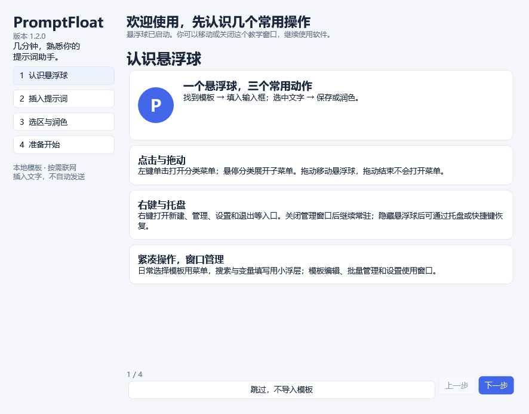

# PromptFloat

**Windows 悬浮提示词助手**：用分层菜单选择模板，在当前光标处插入；选中文字后保存或通过 OpenAI 兼容 API 生成三个润色版本。

A portable Windows prompt-template assistant with a floating menu, local library, and optional three-variant polishing.

[下载最新版本](https://github.com/witchbunting/PromptFloat/releases/latest) · [使用说明](使用说明.md) · [验证报告](验证报告.md) · [更新记录](CHANGELOG.md)



## 下载与运行

1. 从 [Release v1.2.0](https://github.com/witchbunting/PromptFloat/releases/tag/v1.2.0) 下载 `PromptFloat-1.2.0-win-x64.zip`。
2. 解压到可写目录，运行 `PromptFloat.exe`。自带 .NET 运行环境，无需安装 .NET。
3. 新用户会看到四步教学，可以选择初始模板分类。已有初始化数据的用户升级后不重复弹出。

当前交付 Windows x64 便携 ZIP；没有独立安装器。数据位于 `%LOCALAPPDATA%\PromptFloat`，移动或替换程序不会清空模板。升级前退出旧版，避免旧实例继续响应。SHA-256 校验文件随 Release 提供。

## 日常操作

- **插入**：先点击输入框 → 点击常驻“插入”气泡或悬浮球 → 悬停分类 → 单击模板备注。无选区时插入，有选区时替换；不自动发送消息。
- **选区**：选中文字后，球旁显示插入、润色、保存提示词。读取失败时手动复制后从剪贴板新建。
- **润色**：设置 → 智能体，配置 API、模型、密钥与三个风格，点“保存并立即生效”。气泡随球移动；原文和范围有效时可替换，变化后只复制。
- **管理**：右键悬浮球打开模板管理、设置和退出。支持备注、标签、收藏、变量、频次排序、批量操作、回收站、JSON 与自动备份。
- **教学**：设置 → 关于 → 使用教学，可随时回看，不修改已有模板库。

默认快捷键：`Ctrl+Alt+P` 打开菜单，`Ctrl+Alt+S` 保存选区，`Ctrl+Alt+H` 显示 / 隐藏悬浮球。

## 首次启动如何判定

`settings.json` 中的 `TutorialShown` 和 `Initialized` 均为 false 时自动显示。显示前原子写入 `TutorialShown=true`，关闭、跳过或意外中断后均不再自动弹出。完成或关闭时标记初始化，选择完成时才导入勾选分类。

旧设置没有新字段时保持兼容；`Initialized=true` 的旧用户不显示首次教学。标记绑定到用户数据目录，而不是软件版本或解压目录；清空数据或指定新的 `--data-dir` 才属于新使用环境。教学非模态，悬浮球先启动；教学状态保存失败时跳过教学并保留正常使用。

## 数据与联网

模板、统计和设置默认只存本机。只有用户主动润色或测试连接时才调用其配置的 API；润色只发送选中文字和智能体指令。密钥按当前 Windows 用户 DPAPI 加密，不进入模板导出或备份。换电脑后重新填写密钥。

自动填入取决于目标软件的 UI Automation 与权限；不能保证所有控件兼容。密码框、命令终端与仅复制应用不自动填入。详见 [验证范围](验证报告.md) 和 [数据边界](SECURITY.md)。

## 构建与测试

在 Windows 安装 `global.json` 指定的 .NET 10 SDK，然后：

```powershell
powershell -ExecutionPolicy Bypass -File build.ps1
# 在独立桌面会话进行 UI 与跨软件验证：
powershell -ExecutionPolicy Bypass -File build.ps1 -DesktopChecks
powershell -ExecutionPolicy Bypass -File build.ps1 -CompatibilityChecks
```

脚本锁定依赖还原，执行控制台核心测试，发布自包含程序并生成 ZIP 与 SHA-256。GitHub Actions 自动进行核心检查和 Windows 构建；图形桌面 / 第三方软件检查须在有交互桌面的机器单独完成。API 测试使用模拟响应，不调用真实付费接口。

## 项目结构与许可

- `PromptFloat.Core`：模板、SQLite、导入导出、首次教学状态和润色协议。
- `PromptFloat`：WPF 悬浮球、菜单、教学、管理、输入桥接和选区监听。
- `PromptFloat.Tests`：数据及模拟 API 检查。
- `docs`：界面截图、使用与发布说明、已验证版本的公开证据。

代码采用 [MIT License](LICENSE)。第三方运行组件许可见 [第三方声明](LICENSE-THIRD-PARTY.md) 与 `licenses`。贡献说明见 [CONTRIBUTING.md](CONTRIBUTING.md)。
